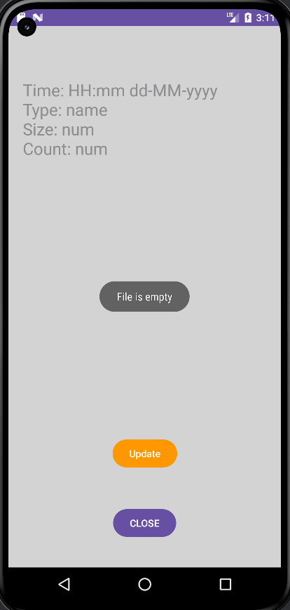
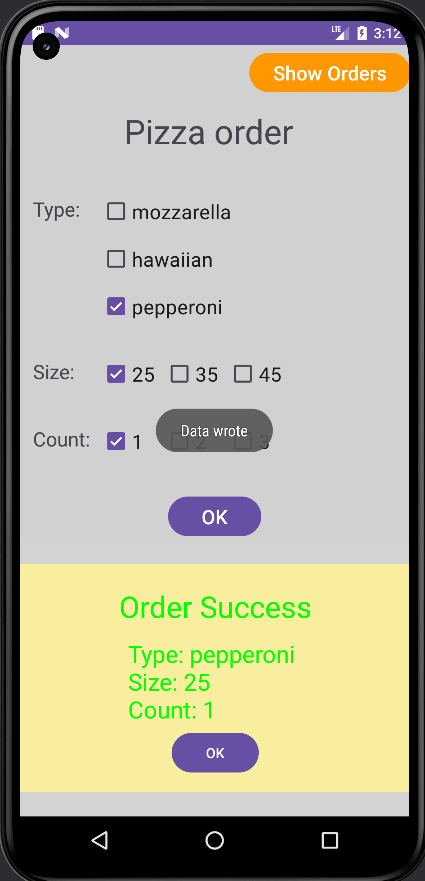
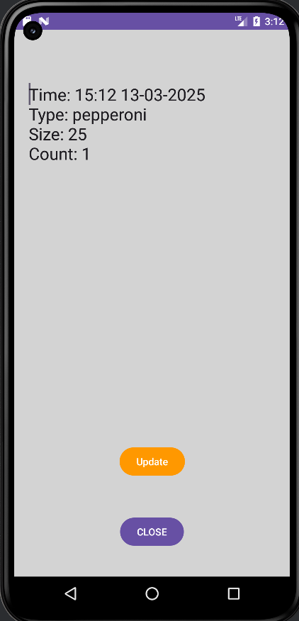
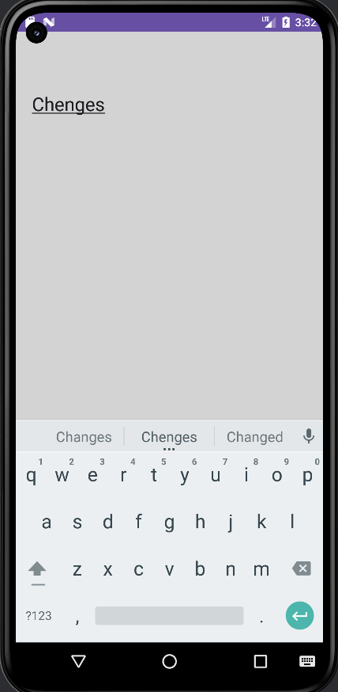
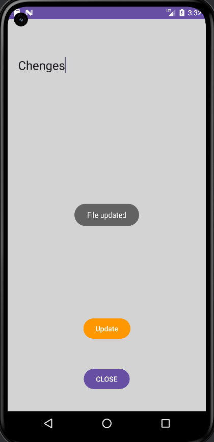
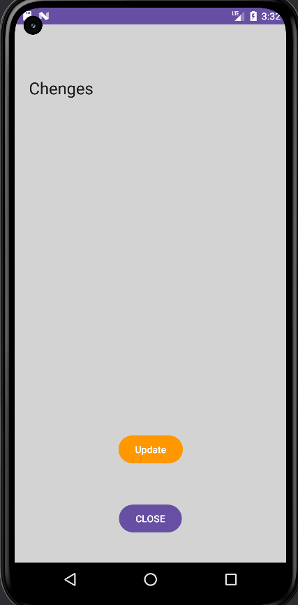

# Android_L3  Варіант 7

Телефонний застосунок для замовлення піци. 

На основному вікні застосунку видно фрагмент де можна вибрати тип ціци, розмір та кількість піц.

Якщо не вибрано якісь дані про піцу, при натискані на кнопу OK підтвердження замовлення, з'являється фрагмент повідомлення з попередженням. Коли фрагмент повідомлення закривається чекбокси не очищаються

Якщо вибрано всі дані та натиснуто кнопуку OK, з'являється фрагмент повідомлення про готовність ордеру. Коли фрагмент закрифається чекбокси очищаються.

Коли замовлення підтверджено відбувається запис даних замовлення у файл, супроводується повідомленням про запис

Якщо натисти кнопку Show Orders відкриється нова діяльність з змінним текстом де відображаються дані замовлень та дві кнопки Update та CLOSE.

Якщо файл з даними пустий з'явиться повідомлення

Щоб змінити дані потрібно натиснути на текст, пілся редагування тексту потрібно натиснути Update для збереження змін.

Щоб повернутися до створення замовлення натиснути CLOSE

## Перевірка роботи 

Запуск програми

Початкове сховище пусте

Записуємо дані

Перевіряємо запис у файл

Редагуємо дані

Зберігаємо зміни

Перевіряємо зміни

