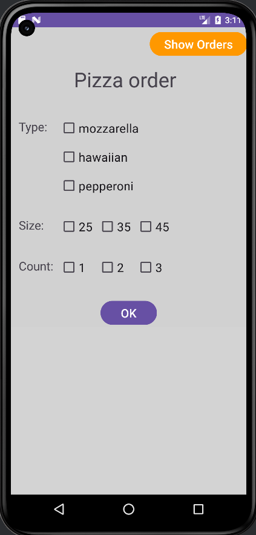
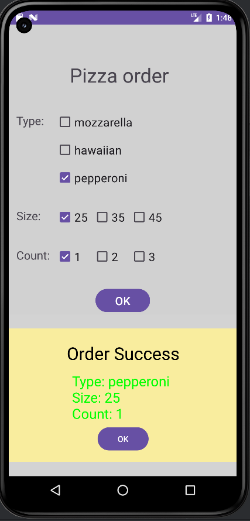
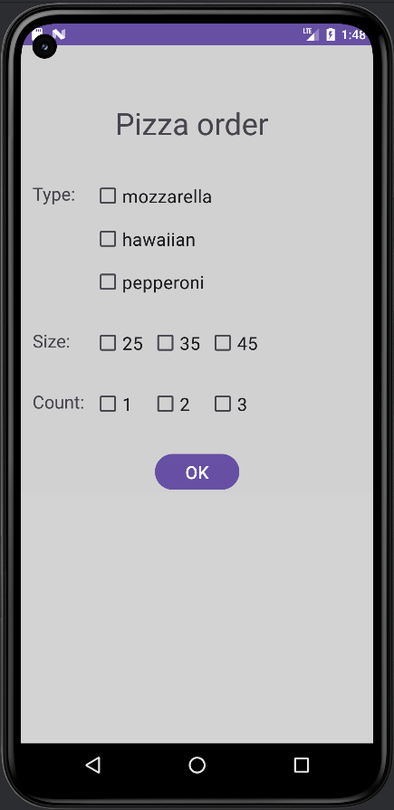
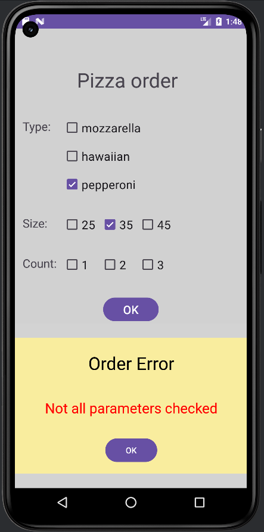
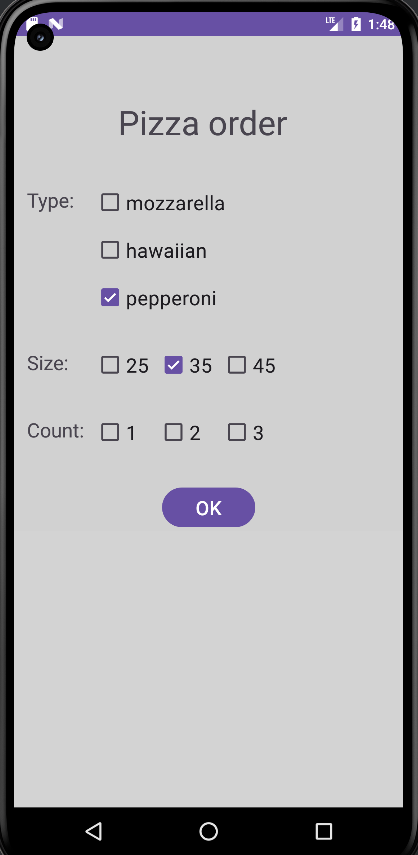

# Android_L2  Варіант 7

Телефонний застосунок для замовлення піци. 

На основному вікні застосунку видно фрагмент де можна вибрати тип ціци, розмір та кількість піц.

Якщо не вибрано якісь дані про піцу, при натискані на кноп підтвердження замовлення, з'являється фрагмент повідомлення з попередженням. Коли фрагмент повідомлення закривається чекбокси не очищаються

Якщо вибрано всі дані та натиснуто кнопуку, з'являється фрагмент повідомлення про готовність ордеру. Коли фрагмент закрифається чекбокси очищаються

## Перевірка роботи 

Запуск програми

Підтвердження

Очищення чекбоксів

Попередження

Не очищаємо чекбокси

